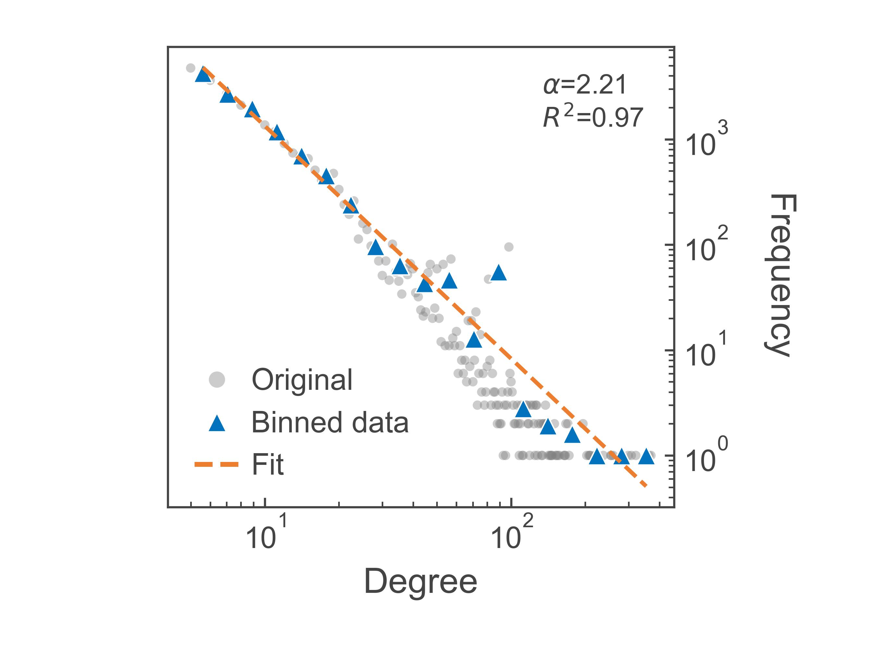

# Complex Co-authorship Structures

[English](README.md) | [简体中文](README.zh-CN.md)

Reproducibility materials for a study of complex co-authorship structures, including network construction, temporal metrics, community analysis, robustness, fractal structure, hierarchy, core-periphery organization, and valued ERGM models.



## Repository structure

- `reproducibility/code`: 41 canonical Python/R algorithm scripts organized into eight numbered topics.
- `reproducibility/data`: data-access instructions and the extraction target for public Release data.
- `reproducibility/results`: extraction target for published computational results.
- `reproducibility/metadata`: algorithm, figure-name, Release, and SHA-256 manifests.
- `visualizations`: plotting scripts, compact figure data, and JPG previews for six manuscript sections.
- `environment`: Python and R dependency declarations.
- `tools`: repository and Release validation utilities.

The eight computational topics are data preparation, network construction, network metrics, community analysis, node importance and robustness, fractal analysis, hierarchy and core-periphery analysis, and ERGM.

## Data availability

Release `v0.1.0` includes the original Web of Science Excel exports used in the study, together with the full author-disambiguation records and their name, address, and affiliation fields. These files are published without anonymization or value replacement so that the released inputs and outputs match the paper's computational record. See [DATA_AVAILABILITY.md](DATA_AVAILABILITY.md) for paths, fields, and reuse considerations.

The Release also preserves the derived networks, author labels, aggregate metrics, model outputs, robustness curves, and plotting data used in the paper.

## Download the reproducibility data

Download Release `v0.1.0` from the [Releases page](https://github.com/ChenKai22567/Complex_co-authorship_structures/releases/tag/v0.1.0), or use GitHub CLI:

```bash
gh release download v0.1.0 \
  --repo ChenKai22567/Complex_co-authorship_structures \
  --dir release_assets
```

Extract the two data archives at the repository root. Their internal paths populate `reproducibility/data`, `reproducibility/results`, and `visualizations/*/data`. The separate figure archive contains only JPG files.

Verify downloaded assets:

```bash
python tools/validate_repository.py --release-dir release_assets
```

## Environment

Python 3.10 or newer is recommended:

```bash
python -m venv .venv
python -m pip install -r environment/requirements.txt
python tools/validate_repository.py --skip-release
```

The nested weighted degree-corrected stochastic block model requires `graph-tool` on Linux. R dependencies for the ERGM workflow are listed in `environment/R_PACKAGES.md`.

## Reproduction workflow

Run the numbered topics in order. After extracting the Release archives at the repository root, the data-preparation scripts can read the included WOS files from their repository-relative paths. Later stages consume earlier results through the same path contract.

1. Prepare and disambiguate bibliographic author records.
2. Construct full, active, backbone, and temporal co-authorship networks.
3. Calculate macro, temporal, degree, clustering, path, and entropy metrics.
4. Detect Infomap communities and calculate community-level measures.
5. Calculate node importance, attack sequences, and exact robustness curves.
6. Run fractal, MST, renormalization-flow, and randomization analyses.
7. Estimate hierarchy and core-periphery roles.
8. Fit valued ERGM specifications using seed 42.

Author disambiguation, Infomap with 1,000 trials, exact robustness, `graph-tool` WDSBM, and ERGM fitting are computationally intensive. Existing verified outputs are provided in the Release; they are not rerun by continuous integration.

## Validation

The validation workflow checks ASCII-only repository paths, cache files, local absolute paths, Python syntax, data contracts, the presence of raw WOS and full disambiguation artifacts in the Release, Release checksums, and JPG integrity. The R parse check is reported as skipped when `Rscript` is unavailable.

## Citation

Use the repository metadata in [CITATION.cff](CITATION.cff). A formal paper citation and DOI will be added as `preferred-citation` when available.

## License

Code is licensed under the [MIT License](LICENSE). Documentation, figures, and original project-produced derived data are licensed under [CC BY 4.0](LICENSE-DATA). Third-party bibliographic records, including WOS exports, remain subject to their original database and subscription terms and are not relicensed by this repository.
